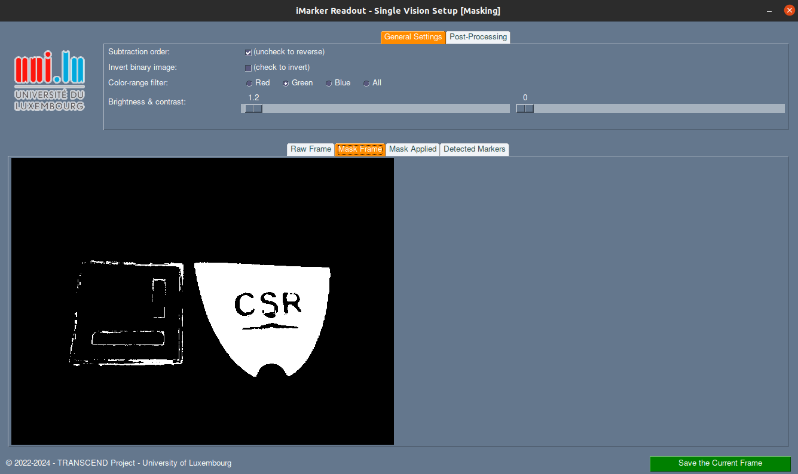

# CSR Detector Standalone (with GUI)



This repository contains the standalone version of **CSR-based object detector** which provides a Graphical User Interface (GUI) for easier usage of the codes. Accordingly, the application is dependant to the repositories below:

- CSR Sensors ([link](https://github.com/snt-arg/csr_sensors)): contains the sensors supported by the application.
- CSR Detector ([link](https://github.com/snt-arg/csr_detector)): contains the detector algorithm to filter CSR-based materials.

## 📚 Preparation

### I. Cloning

When cloning the repository include `--recurse-submodules` after `git clone` such that the submodules are added as well. Accordingly, you can use the command below:

```
git clone --recurse-submodules git@github.com:snt-arg/csr_detector_standalone.git
```

You can also get the latest changes of each submodule individually using the command `git pull --recurse-submodules`.

### II. Installing Python Libraries

Install the required libraries for running this program using the command below:

```
pip install numpy opencv-python PySimpleGUI
```