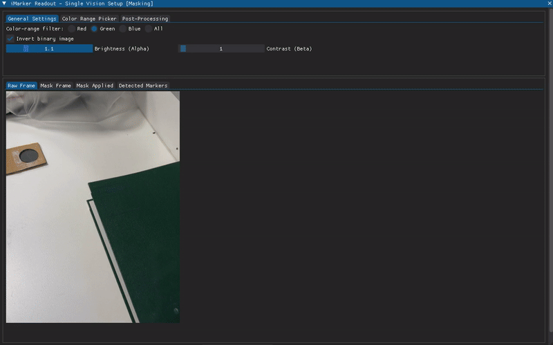

# iMarker Detector Standalone (with GUI)



Welcome to the **iMarker Detector Standalone** repository 💡!
This project provides a **Python-based GUI application** for revealing and detecting **iMarkers** placed in the environment.
To achieve its functionality, this standalone tool integrates the following submodules:

- 🔌 [iMarker Sensor Interfaces](https://github.com/snt-arg/iMarker_sensors) — capture and stream data from various camera setups
- 👁️ [iMarker Detection Algorithms](https://github.com/snt-arg/iMarker_algorithms) — core image processing and marker extraction logic

## 🧠 About iMarkers

**iMarkers** are invisible fiducial markers detectable only by certain sensors and algorithms. They enable robust detection for human-robot interaction, AR applications, and indoor localization.
Read more about iMarkers (developed for the TRANSCEND project at the [University of Luxembourg](https://www.uni.lu/en/)) in [this link](https://snt-arg.github.io/iMarkers/).

## 🛠️ Getting Started

This section will guide you through setting up the **iMarker Detector Standalone** with all necessary submodules and dependencies.

### I. Clone the Repository with Submodules

Clone the repository along with its submodules ([sensor interfaces](https://github.com/snt-arg/iMarker_sensors) and [detector algorithms](https://github.com/snt-arg/iMarker_algorithms)) using:

```bash
git clone --recurse-submodules git@github.com:snt-arg/iMarker_detector_standalone.git
```

> 🛎️ Tip: If you have already cloned it without `--recurse-submodules`, you can initialize and update the submodules afterward:

```bash
git submodule update --init --recursive
```

### II. Environment Setup & Installation

We recommend using `Python>=3.10.4` and a virtual environment to avoid package conflicts.

#### 1. Create and activate a virtual environment:

```bash
python -m venv .venv
source .venv/bin/activate  # On Windows use `.venv\Scripts\activate`
```

#### 2. Install dependencies:

```bash
pip install -r requirements.txt
```

## 🚀 Running the Code

### I. Configure the Application

Before launching the GUI, you need to adjust the configuration settings to match your sensor setup and detection preferences.

- The main configuration file is located at [`config/config.yaml`](./config/config.yaml).
- For detailed explanations of each parameter, refer to the [configuration guide](./config/README.md).

> 🛎️ Tip: The configuration is automatically parsed and applied when launching the application.

### II. Run the Desired Mode

The framework supports various operating modes, configurable via the `mode`/`runner` field in the configuration file:

| Mode          | Description                                |
| ------------- | ------------------------------------------ |
| `sv_offImg`   | Single-vision offline static frame (RGB)   |
| `sv_offImgUV` | Single-vision offline static frame (UV/IR) |
| `sv_offVid`   | Single-vision offline video (RGB)          |
| `sv_usbUv`    | Single-vision USB UV camera setup          |
| `sv_usbIr`    | Single-vision USB IR camera setup          |
| `sv_rs`       | Single-vision RealSense camera setup       |
| `dv_usb`      | Dual-vision USB camera setup               |
| `dv_ids`      | Dual-vision iDS camera setup               |

📌 For **single-vision modes** (`sv_*`), you can choose between:

- `temporalSubtraction = True` → **Sequential frame subtraction**
- `temporalSubtraction = False` → **Color masking (no impact for UV/IR cameras)**

Once the configuration is set, navigate to the project root and run:

```bash
# Activate the virtual environment
source .venv/bin/activate

# Option 1: Run with the mode specified in the config
python main.py

# Option 2: Override the mode via command-line argument
# (Pick one: sv_offImg, sv_offVid, dv_usb, dv_ids, sv_rs)
python main.py --mode sv_rs
```

The script will automatically launch the appropriate runner based on your selected mode.
